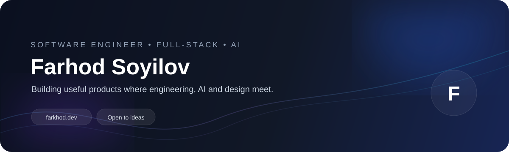

<div align="center">



<br/>

<a href="https://farkhod.dev">
  
</a>
<a href="https://github.com/Farhodoff">
  
</a>
<a href="mailto:fsoyilovv@gmail.com">
  
</a>

</div>

---

## 👨‍💻 About Me


I’m **Farhod Soyilov**, a full-stack developer focused on building modern web products, AI-powered applications, reusable UI systems, and real-time experiences.

I care about more than just writing code — I like taking an idea from **product concept → architecture → interface → implementation → production**.

### Currently focused on

- 🤖 AI-powered products and developer tools
- ⚛️ React + TypeScript application architecture
- 🧩 Reusable component systems and design systems
- 🐍 Python for AI and backend workflows
- 🗄️ PostgreSQL / Supabase and production data architecture
- ⚡ Real-time applications and developer experience
- 🎌 Building technology around Japanese language learning

---

## 🧰 Tech Stack

### Frontend

<p>


</p>

### Backend / Data

<p>


</p>

### AI / Real-Time

<p>


</p>

### Engineering Tools

<p>


</p>

---

## ⭐ Selected Projects

<table>
<tr>
<td width="50%" valign="top">

### 🎌 Nihongo Talk

An AI-powered Japanese learning platform built around **JLPT N5 → N1** progression.

**Core systems**
- 🎙️ Real-time AI speaking coach
- 🧠 AI grammar & vocabulary feedback
- 🈶 Kanji writing / stroke practice
- ⚡ Anki SM-2 spaced repetition
- 📝 Full JLPT mock exams
- 🗺️ Adaptive study roadmap
- 👥 WebRTC study room
- 🛡️ Production Supabase data layer

**Stack**

`React` `TypeScript` `Vite` `Supabase` `PostgreSQL` `AI` `WebRTC`

<br/>

<a href="https://github.com/Farhodoff/nihongo-talk">→ View project</a>

</td>

<td width="50%" valign="top">

### 🧩 Super UI

A reusable React component system focused on **accessible, production-ready interfaces**.

**Core systems**
- 50+ reusable components
- Radix UI primitives
- Tailwind CSS
- Theme customization
- Internationalization
- Auth / dashboard templates
- Storybook documentation
- TypeScript-first architecture

**Stack**

`React` `TypeScript` `Tailwind` `Radix UI` `Storybook`

<br/>

<a href="https://github.com/Farhodoff/components-main">→ View project</a>

</td>
</tr>

<tr>
<td width="50%" valign="top">

### ⚡ Super UI CLI

A CLI for adding Super UI components directly into React projects.

```bash
npx @farhod_dev/super-ui add button
```

The CLI handles project initialization, package-manager detection, component installation, and dependency setup.

<a href="https://www.npmjs.com/package/@farhod_dev/super-ui-cli">→ View on NPM</a>

</td>

<td width="50%" valign="top">

### 🏗️ What I Build

I’m especially interested in products combining:

- **Product thinking**
- **Strong UI / UX**
- **AI**
- **Real-time systems**
- **Developer experience**
- **Clean architecture**

> Build something useful, then make it better.

</td>
</tr>
</table>

---

## 📈 GitHub

<div align="center">

<a href="https://github.com/Farhodoff">
  
</a>

<br/><br/>


</div>

> **If these statistic cards ever fail to load**, the rest of this README is intentionally independent of them. The important profile content uses repository-local assets instead of fragile external image hosts.

---

## 🧭 Engineering Philosophy

```text
01  Understand the problem
02  Design the simplest useful solution
03  Build with maintainable architecture
04  Test the important paths
05  Ship
06  Measure
07  Improve
```

I prefer **small, composable systems** over unnecessary complexity — with strong typing, clear boundaries, and a UI that feels intentional.

---

## 📫 Connect

<div align="center">

<a href="https://farkhod.dev">
  
</a>
<a href="https://github.com/Farhodoff">
  
</a>
<a href="mailto:fsoyilovv@gmail.com">
  
</a>

<br/><br/>


</div>

---

<div align="center">

**Thanks for stopping by.** 👋

<sub>Designed for GitHub Profile · Built with Markdown + local SVG assets</sub>

</div>
